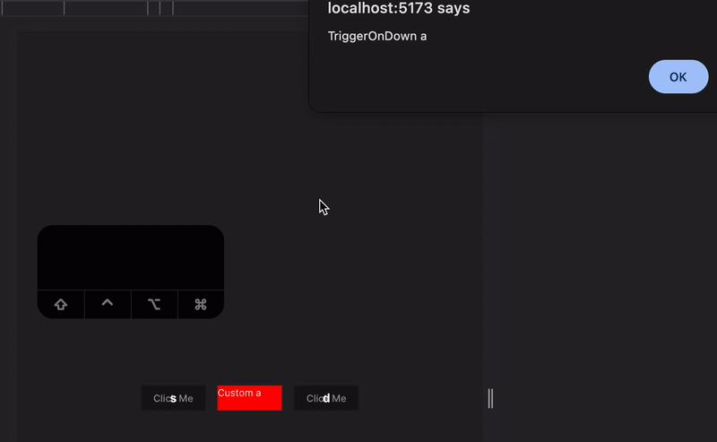

# The Old School

This repository consists of my recreation of libraries that we have now. I used to prefer to minimize external library usage, but this does not mean we don't have to use them. The use of an external library helps us to focus less on complex work that we don't need to do. Here I will be posting some commonly used libraries and functions recreated using basic codes which might not satisfy usage as that of the original library but will help developers understand the basic core functionalities.

## Running Locally

1. First clone the repo
2. Run yarn command to download node_modules with `yarn`
3. Run `yarn dev` to run in dev mode

## 1. Keyboard Shortcut

This example explains how I had built keyboard shortcut feature without using any external library.


### Setup

#### 1. You need to initialize `MainListener` in your root file.

Make sure this is only executed ones. I will update later for singleton effect.

##### Code Example

```javascript
import { MainListener } from './utils/KeyboardShortcut'
function App() {
...
  useEffect(()=>{
    //Initialize the listener
    new MainListener().initialize()
  },[])
  ...
  return <>
  ...your project here
  </>
}
```

#### 2. Import `KeyboardWrapper` and use it in the component where you want your shortcut to execute with required props

##### Code Example

```javascript
import { KeyboardWrapper } from './utils/KeyboardShortcut'
...

return <div>
  ...
  <KeyboardWrapper
        onDown={()=>{
          console.log("TriggerOnDown a")
        }}
        label="a"
        combination={'Alt+a'}
    >
  ...
  </div>
```

#### Note

Make sure you are not running this in strict mode, else the listener might be initialized twice.

Change From

```javascript
<React.StrictMode>
    <App />
</React.StrictMode>,
```

To

```javascript
<App />
```

## 2. Object Difference

There are 3 functions available in this module.

### 1. convertNestedToBasic

This function converts nested object into top level object

#### Code Example

```js
console.log(
  'convertNestedToBasic',
  convertNestedToBasic({
    profile: { name: 'Prasidha Karki', address: { municipality: 'Munic' } },
    address: '2das',
    items: [
      { id: 1, product_id: 2 },
      { id: 1, product_id: 2 },
    ],
  })
);
```

### 2. convertBasicToNested

This function converts basic object into nested one based on key string

#### Code Example

```js
console.log(
  'convertBasicToNested',
  JSON.stringify(
    convertBasicToNested({
      'profile.name': 'Prasidha Karki',
      address: '2das',
      'items[0].id': 1,
      'items[0].product_id': 2,
      'items[2].id': 1,
      'items[2].product_id': 2,
      'profile.address.municipality': 'Ganja',
    })
  )
);
```

### 3. calculateDeltaBaseObject

This gives the difference of first object from the second one.

#### Code Example

```js
const oldObject = convertNestedToBasic({
  profile: { name: 'Prasidha Karki', address: { municipality: 'Munic' } },
  address: '2das',
  items: [{ id: 1, product_id: 2 }, null, { id: 1, product_id: 2 }],
});
const newObject = convertNestedToBasic({
  profile: { name: 'Prasidha Karki', address: { municipality: 'Munic2', ward: 2 } },
  address: 'Name',
  items: [
    { id: 1, product_id: 2 },
    { id: 1, product_id: 2 },
  ],
});
console.log(
  'calculateDeltaBaseObject',
  convertBasicToNested(calculateDeltaBaseObject(oldObject, newObject))
);
```
